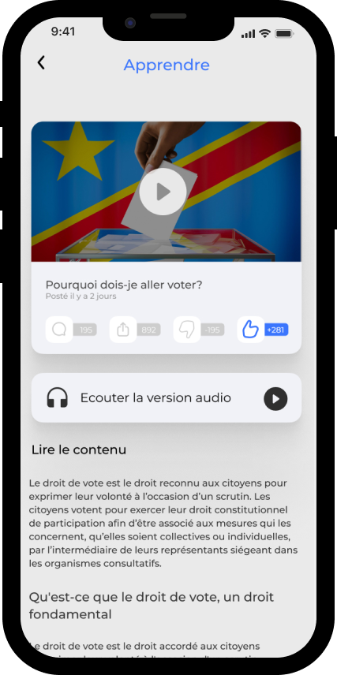

# MEDIATHON
Application mobile pour la sensibilisation au processus electoral de la population congolaise.

## Prototype (UI Interactif)

> _Le prototype simule le fonctionnement de l'application mobile en développement, il est conçu avec l'outil de prototypage #Figma_

Trouvez le prototype ou le UI UX de cette application pour voir ou comprendre ce à quoi elle est devrait ressemnler à la fin du développement en liquant sur ce lien
- [UI Demo](https://www.figma.com/proto/XbpxuJYejraLf3Ik2npwL9/mediaapp?node-id=220%3A1712&scaling=min-zoom&page-id=220%3A1687)

## Captures

| Screen 1  | Screen 2 | Screen 3 | Screen 4 |
| ------------- | ------------- | ------------- | ------------- |
|   |   |  |  |

